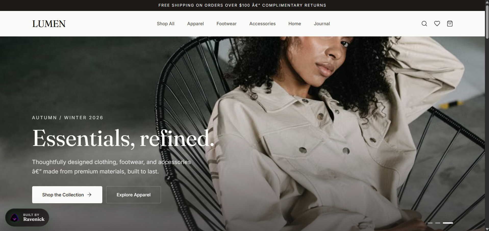

# LUMEN Modern Essentials

A refined, OC-themed ecommerce storefront for modern clothing, footwear, accessories, and home goods. The interface demonstrates custom client-side routing, catalog browsing, product detail flows, cart state management, and checkout interactions within a clean editorial shopping aesthetic.

> [!NOTE]
> [Live demo](https://lumen-essentials.vercel.app/)

## Preview




## Features

- Custom route provider for home, shop, product detail, cart, and checkout page states
- Product catalog with category metadata, image galleries, color swatches, sizes, ratings, badges, and sale pricing
- Animated hero gallery, category tiles, editorial banner, marquee strip, and featured product sections
- Cart context with add, remove, quantity update, subtotal, total item count, drawer open, and drawer close workflows
- Product detail workflow with selected size/color variants and add-to-cart behavior
- Dedicated cart and checkout pages for a complete storefront interaction path
- Fixed Ravenick portfolio badge with logo lockup and sheen animation
- Portfolio-ready SEO metadata authored for Nelson Emmanuel | Ravenick

## Built With

| Tool           | Use                                             |
| -------------- | ----------------------------------------------- |
| React 18       | Storefront rendering, context state, and routing |
| TypeScript     | Typed products, categories, cart items, and pages |
| Tailwind CSS 4 | Theme tokens, responsive layouts, and animation  |
| Lucide React   | Interface icons and ecommerce action markers     |
| Vite           | Production compilation and development runtime   |

## Project Structure
```text
src/
  components/
    CartDrawer.tsx
    Footer.tsx
    Header.tsx
    ProductCard.tsx
    RavenickBadge.tsx
  pages/
    CartPage.tsx
    CheckoutPage.tsx
    HomePage.tsx
    ProductDetailPage.tsx
    ShopPage.tsx
  App.tsx
  cart.tsx
  data.ts
  index.css
  main.tsx
  router.tsx
  types.ts
  utils.ts
public/
  oc-logo-no-bg.png
```

## Run Locally
```bash
git clone https://github.com/Ravenick/lumen-ecommerce.git
cd "lumen-ecommerce"
npm install
npm run dev
```

Create a production build with:
```bash
npm run build
```

## Author

Nelson Emmanuel | Raven
